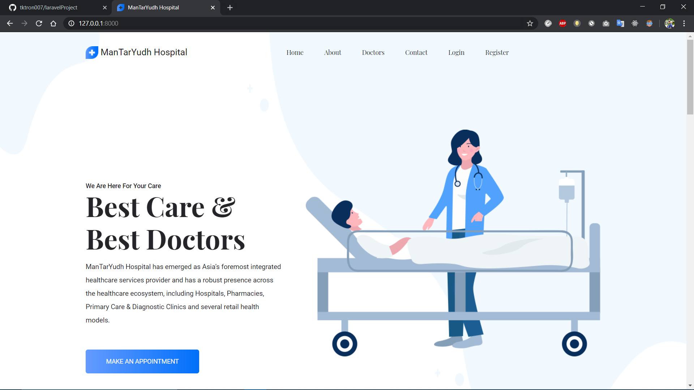
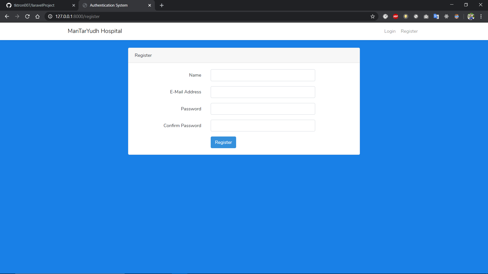
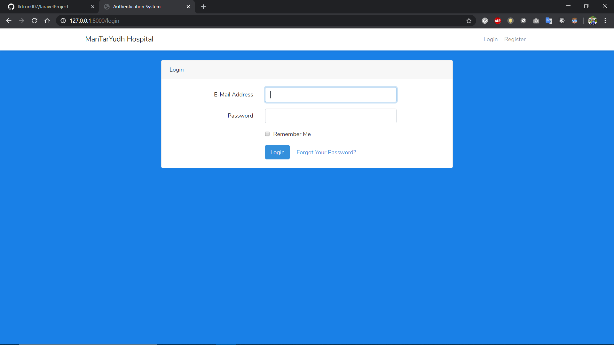
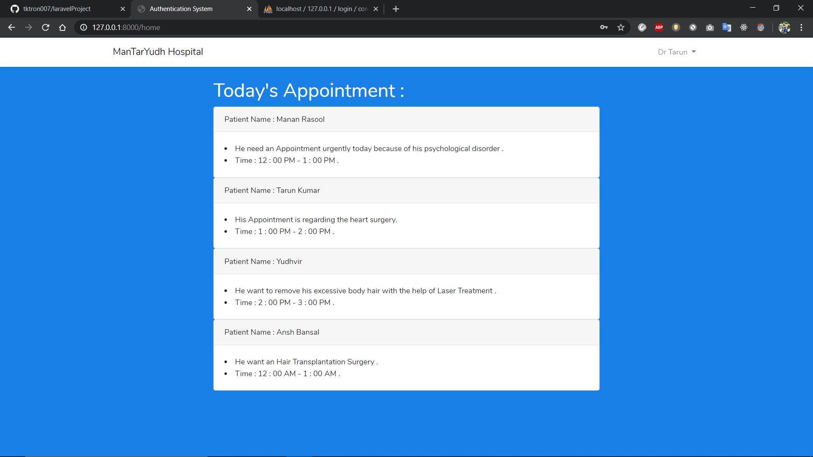
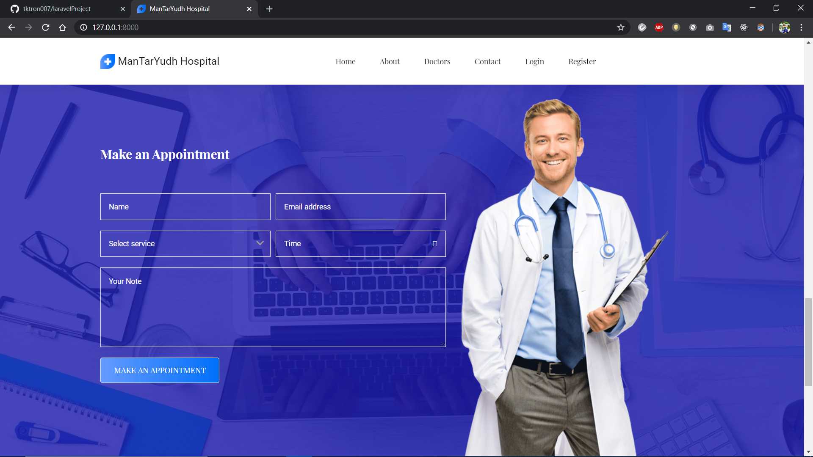
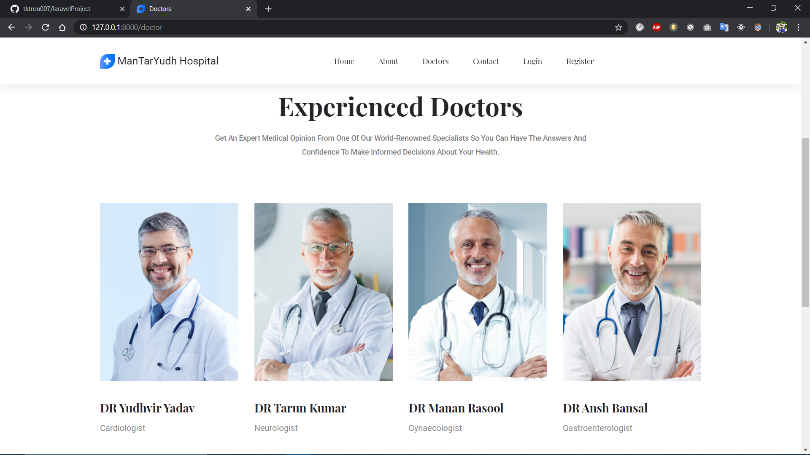
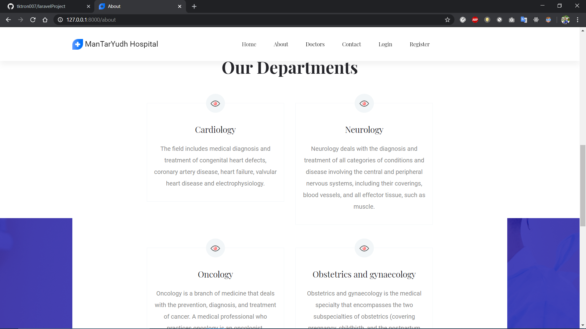
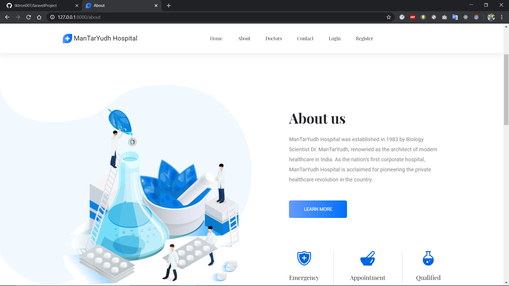

## About this Project 

This project is useful in managing the tasks in hospital of Doctors and Patients . In this Project , Patient can fill the appointment in the respective domain or field . This appointment is shows in the account of the doctor of that field or domain . Doctor can take inforamation of appointment after login from the portal .
This Project is develop using PHP and Laravel technologies . 

PHP is a general-purpose scripting language that is especially suited to web development.
Laravel is a web application framework with expressive, elegant syntax. We believe development must be an enjoyable and creative experience to be truly fulfilling.

# Home Page

# Registration

# Login

# Appointment

# Doctors

# Departments

# About us 

## License

The Laravel framework is open-sourced software licensed under the [MIT license](https://opensource.org/licenses/MIT).
